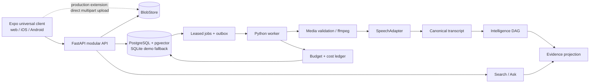

# Pocket Demo architecture

This document translates `POCKET_DEMO_FINAL_DESIGN_AND_ARCHITECTURE.md` into the
repository's implementation boundaries. The design document remains authoritative
for product invariants and acceptance criteria.

## Deliberate platform adaptation

The final design names Next.js for a browser-only client. This repository uses Expo
Router and React Native Web instead because the implementation must ship from one
TypeScript source tree to web, iOS, and Android. Authenticated product screens do not
need server rendering, so the change does not weaken a demo requirement. Platform-
specific files are limited to operating-system seams such as picking/uploading a
file, browser drag-and-drop, session transport, and media playback.

The backend remains a modular FastAPI application. Its domain contracts do not know
which client platform called them.

## Runtime topology



The local lightweight profile uses SQLite and a filesystem blob store so the demo
can start with no cloud accounts. The Compose profile uses PostgreSQL with the
pgvector extension available, MinIO, separate API and worker processes, and ffmpeg;
fixture retrieval remains lexical until an embedding adapter is implemented. Provider
adapters have the same contracts in both profiles.

## Trust boundaries and invariants

1. **The original is immutable.** Upload bytes are quarantined, hashed, validated,
   then promoted under an opaque recording- and deletion-generation-scoped key.
   Playback derivatives can never replace the original.
2. **Canonical assets publish independently.** Original media, transcript,
   intelligence, and indexed evidence each have a readiness flag and version.
   A later-stage failure therefore preserves earlier useful work.
3. **Mocks do not invent evidence for arbitrary media.** Without a configured speech
   provider, only approved fixtures with known hashes can publish fixture transcripts.
   Other valid files stop honestly in a partial `speech_unconfigured` state.
4. **Citations are the common currency.** Intelligence, tasks, search results, and Ask
   answers refer back to an accessible transcript version, segment, and time range.
5. **Workspace scope is server-derived.** A stored session selects a workspace after
   membership validation. Callers cannot nominate a workspace ID to widen a query.
6. **At-least-once work has effectively-once product effects.** Stable idempotency
   keys, unique attempt/provider identifiers, immutable outputs, compare-and-swap
   publication, and deletion-generation checks contain duplicate delivery.
7. **Deletion wins fixture races.** Tombstoning immediately blocks grants and
   retrieval; workers recheck generation around local fixture work and before
   publication. A paid remote dispatcher must additionally make its final deletion
   fence and provider dispatch atomic/idempotent so no call starts in that narrow gap.
8. **Cost claims remain qualified.** Attempt costs, platform allocation, and a
   versioned counterfactual are separate. Before provider reconciliation, the UI calls
   model spend an estimate and calls the comparison a modeled scenario delta.

## Package ownership

```text
apps/client/       Universal product UI and platform adapters
services/api/      API, worker, persistence, domain services, and provider ports
fixtures/          Approved synthetic media metadata and canonical sidecars
infra/             Containers and production-shaped local services
scripts/           Reproducible setup, fixture, and contract tooling
docs/              Architecture, operations, and handoff documentation
```

The backend stays a modular monolith. Authentication, recordings, artifacts,
processing, providers, retrieval, Ask, tasks, costs, and deletion are logical
boundaries, not separately deployed microservices.

## Provider modes and local helpers

- `fixture`/`mock`: a known media hash resolves to checked-in, human-readable canonical
  artifacts. This is the only no-key path that exercises the complete AI workflow.
- `remote`: a reserved mode for future speech, LLM, and embedding adapters. This
  checkpoint deliberately has no network implementation and fails startup if remote
  mode or remote-call permission is requested. A future adapter must use the existing
  reservation/admission service with honest nonzero estimates, then add capability
  checks, invoice reconciliation, and long-call lease heartbeats before paid calls.

Non-generative helpers—lexical ranking, extractive cited answers, projections, and
exports—run locally; they are components, not a selectable `PROVIDER_MODE`.

Provider selection is policy, not a UI concern. Stable aliases (`speech.standard`,
`speech.strong`, `llm.cheap`, `llm.strong`, and `embed.multilingual`) resolve to exact
IDs recorded in provenance and cost events.

## Canonical lifecycle

```text
UPLOADING -> VERIFYING -> SEALED -> PROCESSING -> READY
                  |                       |-> PARTIAL
                  |                       |-> FAILED_RETRYABLE
                  |                       |-> FAILED_FINAL
                  |                       |-> CANCELLED
                  +----------------------------> DELETING -> DELETED
```

A correction creates a transcript version and invalidates/rebuilds intelligence and
evidence without invoking speech again. A Deep regeneration creates a new downstream
version and budget once a strong remote adapter exists; the fixture build rejects that
request explicitly. Cancel preserves committed canonical assets; delete purges content
while retaining de-identified attempt-cost records for spend integrity.

## Configuration boundary

Only client-safe values may use the `EXPO_PUBLIC_` prefix. Provider credentials,
database/object-store credentials, session secrets, routing policy, and price data
belong only in the server environment. The repository provides a placeholder
`.env.example`; real `.env` variants are ignored and are never required for the
fixture-backed lightweight profile.

## Scale extension points

The interfaces intentionally permit PostgreSQL/pgvector, S3-compatible multipart
uploads, managed provider callbacks, and a separately leased worker. Dedicated vector
services, Kafka, Kubernetes, owned GPUs, scheduled memory, connectors, and enterprise
identity remain deferred until measured load or product requirements justify them.

Instrumented calls reserve budget durably under a workspace admission lock, then
commit, release, or mark ambiguous attempts for reconciliation. Fixture calls reserve
zero dollars, so this demonstrates lifecycle semantics rather than paid-provider
pricing. A remote extension must supply conservative nonzero estimates and reconcile
actual provider billing before the ledger or budget can be treated as financial truth.
